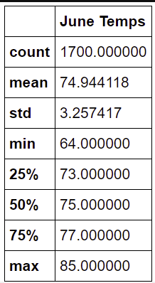
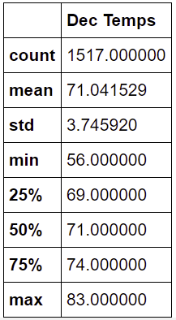
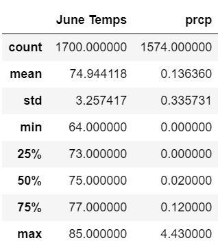
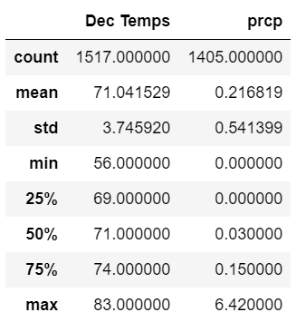
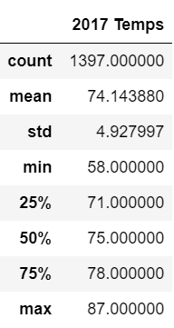

# Surfs Up

## Overview of the statistical analysis:
The analysis details weather patterns by month for the island of Oahu to decide if this idea of a surf and ice cream shop is viable all year-round. The statistical analysis is calculated for each month to include count, mean, std, min, 25% + 50% + 75% quartiles, and max for each dataframe.

## Results:
June Weather Results:

December Weather Results:

-   Max temp for June is 85 and Max temp for December is 83 

-   Min temp for June is 64 and Min temp for December is 56

-   Average temp for June is 75 and Average temp for December is 71 

## Summary:

Based on analysis, Oahu has an ideal climate year round. The temperature data for the months of June and December, presents warm and not too hot or cold weather.

### Additional Queries:

Using data we were able to find the percipitation for a month of June adn December. 

June Temperatures + Precipitation:

December Temperatures + Precipitation:

-   There is a lot more rain during December with the average at 0.22 and the max at 6.42 compared to June with the average at 0.14 and the max at 4.43.

-   The average yearly temperature is 74 degrees, with the min at 58 degrees and max at 87 degrees.
